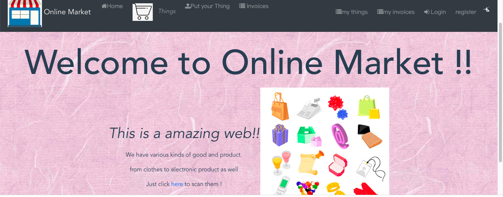
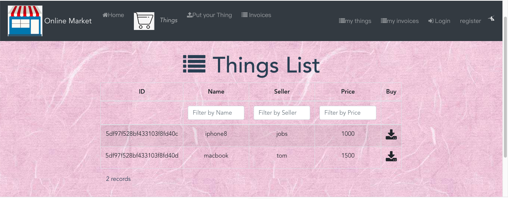
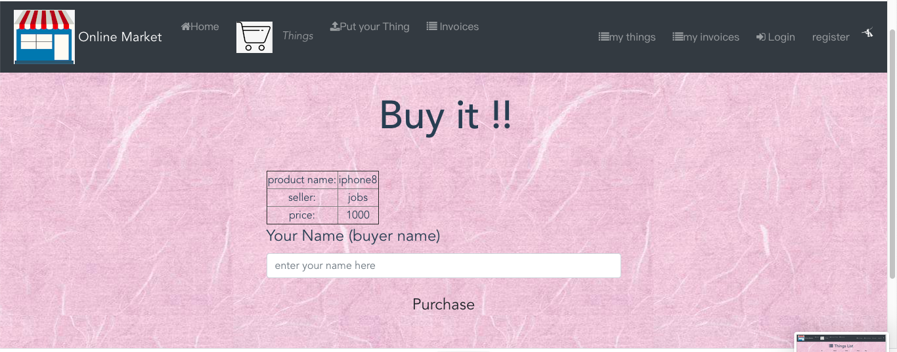
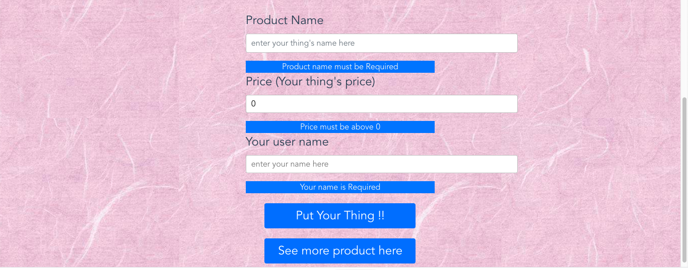
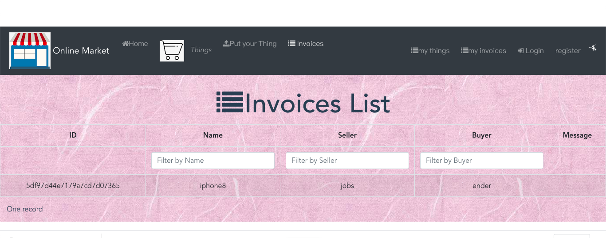
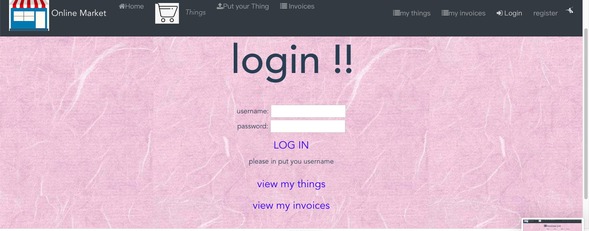
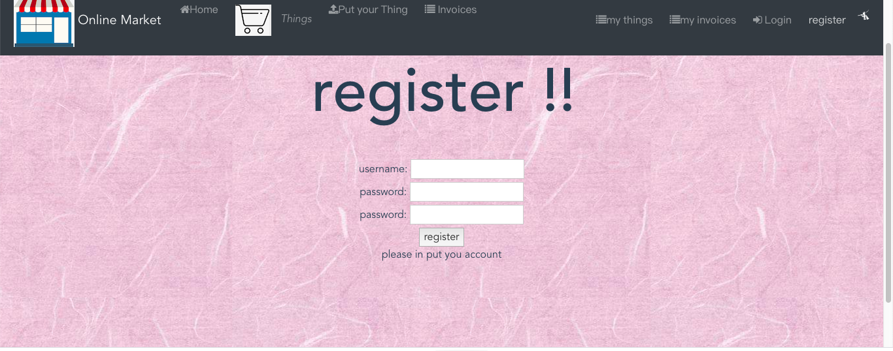
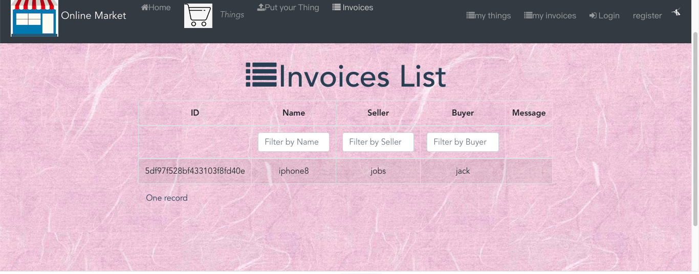
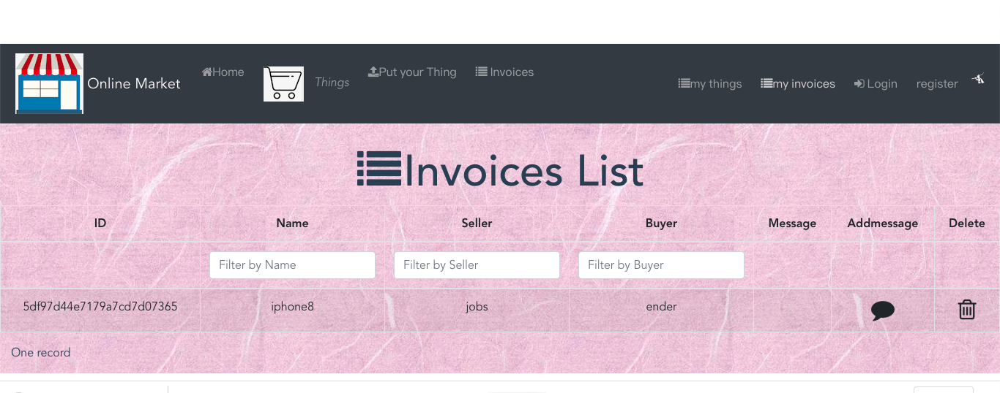

## Online Market Web API.

# Assignment 2 - Agile Software Practice.

Name: Yuchao Yin. \
ID: 20086452

## Client UI.

 
>>Home page of my projeect
 
>>show Things
 
>>buy a thing
 
>>put a thing
 
>>show invoice
 
>>login page 
 
>>register page

>>my things
 
>>my invoices 

## E2E/Cypress testing.

(Optional) State any non-standard features (not covered in the lectures or sample code provided) of the Cypress framework that you utilized.

## Web API CI.

(Optional) State the GitLab Pages URL of the coverage report for your Web API tests, e.g.

https://enderyin.gitlab.io/-/online-market-cicd-yin/-/jobs/382678060/artifacts/coverage/lcov-report/index.html
## GitLab CI.

(Optional) State any non-standard features (not covered in the lectures or labs) of the GitLab CI platform that you utilized.

[home]: image/donate.png
